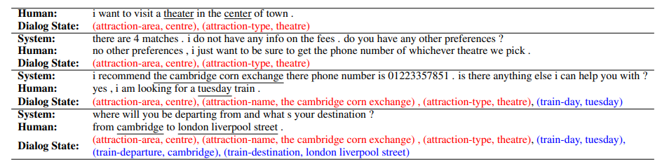
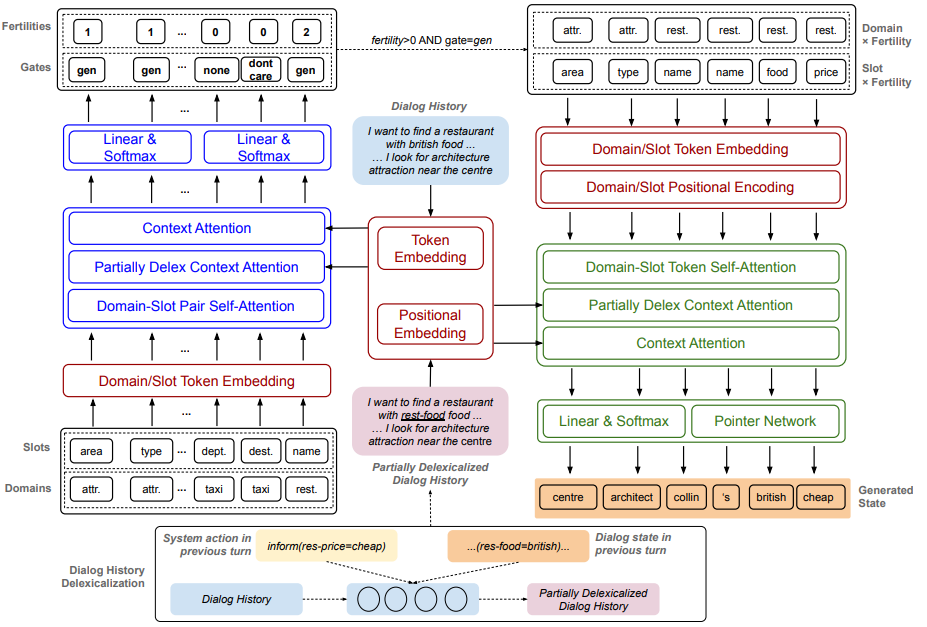
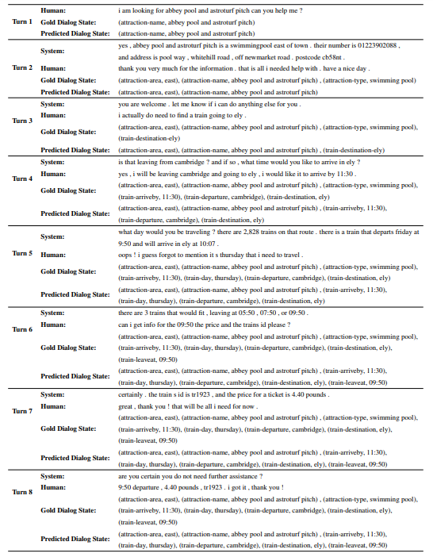

## Non-Autoregressive Dialog State Tracking
 

This is the PyTorch implementation of the paper:
**[Non-Autoregressive Dialog State Tracking](<https://openreview.net/forum?id=H1e_cC4twS>)**. [**Hung Le**](https://github.com/henryhungle), [Richard Socher](https://www.socher.org/), [Steven C.H. Hoi](https://sites.google.com/view/stevenhoi/). ***[ICLR 2020](<https://openreview.net/group?id=ICLR.cc/2020/Conference>)***. 

This code has been written using PyTorch 1.0.1. If you use the source code in this repo in your work, please cite the following paper. The bibtex is:
<pre>
@inproceedings{
le2020nonautoregressive,
title={Non-Autoregressive Dialog State Tracking},
author={Hung Le and Steven C.H. Hoi and Richard Socher},
booktitle={International Conference on Learning Representations},
year={2020},
url={https://openreview.net/forum?id=H1e_cC4twS}
}
</pre>

## Abstract
Recent efforts in Dialogue State Tracking (DST) for task-oriented dialogues have progressed toward open-vocabulary or generation-based approaches where the models can generate slot value candidates from the dialogue history itself. These approaches have shown good performance gain, especially in complicated dialogue domains with dynamic slot values. However, they fall short in two aspects: (1) they do not allow models to explicitly learn signals across domains and slots to detect potential dependencies among \textit{(domain, slot)} pairs; and (2) existing models follow auto-regressive approaches which incur high time cost when the dialogue evolves over multiple domains and multiple turns. In this paper, we propose a novel framework of Non-Autoregressive Dialog State Tracking (NADST) which can factor in potential dependencies among domains and slots to optimize the models towards better prediction of dialogue states as a complete set rather than separate slots. In particular, the non-autoregressive nature of our method not only enables decoding in parallel to significantly reduce the latency of DST for real-time dialogue response generation, but also detect dependencies among slots at token level in addition to slot and domain level. Our empirical results show that our model achieves the state-of-the-art joint accuracy across all domains on the MultiWOZ 2.1 corpus, and the latency of our model is an order of magnitude lower than the previous state of the art as the dialogue history extends over time. 

  
 A sample task-oriented dialogue with annotated dialogue states after each user turn. The dialogue states in red and blue denote slots from the attraction domain and train domain respectively. Slot values are expressed in user and system utterances (highlighted by underlined text).

## Model Architecture

Our NADST has 3 key components: encoders (red), fertility decoder (blue), and state decoder (green). 
	(i) Encoders encode sequences of dialogue history, delexicalized dialogue history, and domain and slot tokens into continuous representations; (ii) Fertility Decoder has 3 attention mechanisms to learn potential dependencies across \textit{(domain, slot)} pairs in combination with dialogue history. The output is used to generate fertilities and slot gates; and (iii) State Decoder receives the input sequence including sub-sequences of `(domain, slot) x fertility` to decode a complete dialogue state sequence as concatenation of component slot values. For simplicity, we do not show feedforward, residual connection, and layer-normalization layers in the figure. Best viewed in color. 

## Dataset

We use the MultiWOZ benchmark, includin both version 2.0 and 2.1. The data can be found in the folder `data` in the repo root folder. 

## Scripts 

We created `run.sh` to prepare evaluation code, train models, generate dialogue states, and evaluating the generated states with automatic metrics. You can directly run this file which includes example parameter setting: 

| Parameter           | Description                                                  | Values                                                       |
| :------------------ | :----------------------------------------------------------- | ------------------------------------------------------------ |
| path     | path where the model and training logs will be saved | e.g. save_temp/nadst_model |
| d      | the embedding dimension to embed word tokens into continuous representations              | e.g. 256 |
| h_attn | the number of attention heads applied in all attention blocks                   | e.g. 16 |
| d2s_nn_N        | Number of layers/attention steps in fertility decoder                                  | e.g. 3                                                  |
| s2s_nn_N        | Number of layers/attention steps in state decoder                                | e.g. 3                                                     |
| bsz          | Number of instances in each training batch                                    | e.g. 32                                                      |
| wu        | Number of warmup steps to increase the learning rate                                      | 20000                                                    |
| dr        | Dropout rate during training                                 | e.g. 0.2                                                     |
| dv        | The data version of the MultiWOZ benchmark                                 | either 2.0 or 2.1                                                     |

While training, the model with the best validation is saved. The model is evaluated by using the losses from gate prediction, fertility prediction, and state generation. 
The model output, parameters, vocabulary, and training and validation logs will be save into folder determined in the `path` parameter.  

Other parameters, including data-related options, model parameters,  training and generating settings, are defined in the file `utils.config.py`.

## Sample Dialogue State

Example predicted dialogue states for dialogue ID MUL0536 in MultiWOZ2.1

